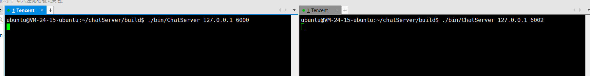
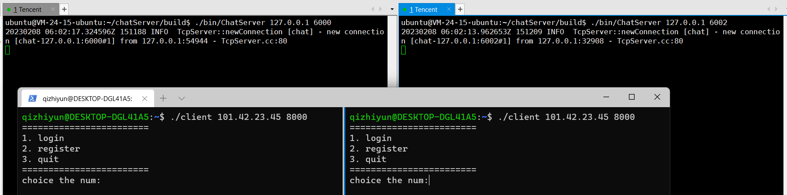
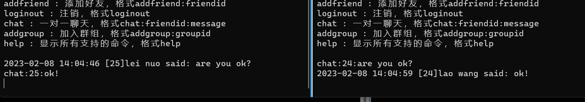

# 集群聊天服务器

在 Linux 环境下基于 muduo 开发的集群聊天服务器。实现新用户注册、用户登录、添加好友、添加群组、好友通信、群组聊天、保持离线消息等功能。通过nginx+redis实现多机的部署及通讯。


## 项目特点

- 基于 muduo 网络库开发网络核心模块，实现高效通信
- 使用第三方 JSON 库实现通信数据的序列化和反序列化
- 使用 Nginx 的 TCP 负载均衡功能，将客户端请求分派到多个服务器上，以提高并发处理能力
- 基于发布-订阅的服务器中间件redis消息队列，解决跨服务器通信难题
- 封装 MySQL 接口，将用户数据储存到磁盘中，实现数据持久化
- 基于 CMake 构建项目

## 项目依赖

* muduo网络库
* json库JSON for Modern C++   
* redisC/C++客户端hiredis库
* MySQL客户端编程库libmysqlclient

## 项目开发环境

* OS：Ubuntu 20.4 TLS
* Complier：g++ 9.3
* MySQL：8.0


## 项目运行环境搭建

1、创建数据库

```bash
# 连接MySQL数据库
mysql -u root -p
# 创建项目数据库
create database chat;
source chat.sql
```

2、构建项目

```bash
mkdir build && cd build
cmake ..
make
```

## 运行展示

1、服务器端分别监听6000 与6002端口，nginx监听8000端口

```bash
./ChatServer 127.0.0.1 6000
./ChatServer 127.0.0.1 6002
```




2、多个客户端登录连接8000端口，nginx负载负载均衡。     

```bash
./client 127.0.0.1 8000
./client 127.0.0.1 8000
```

可看到不同的客户端登陆到了不同的服务器。



下面可看出登陆在不同服务器的客户完成了通信。




## TODO

* 完成从配置文件加载配置
* 实现连接池

